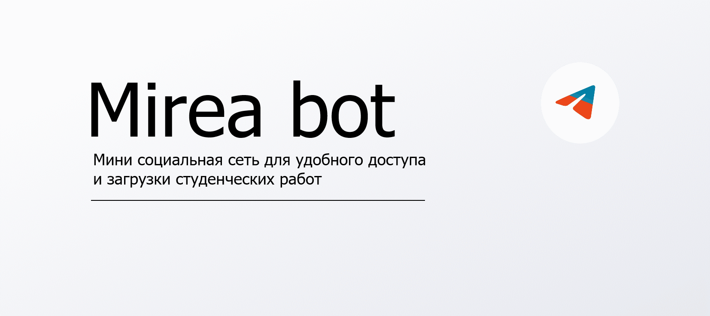

Проект разработан для учащихся вуза РТУ МИРЕА и Колледжа Програмирования и Кибербезопасности

# Ссылки на ботов для ознакомления:
___
>[БОТ Телеграм](https://t.me/Cheatbase_bot)
>
>[БОТ ВКонтакте ](https://vk.com/mireabot)
___

# Основная цель проекта:
- Создание общей базы с готовыми работами и ответами на тесты среди учащихся

Бот написан на асинхронных библиотеках aiogram и vkwave, имеет централизованную БД на sqlite.

# Основные достоинства:
- Скорость работы
- Элегантные решения по задачи выдачи работ пользователю
- Доступность для пользователя
- Расширенную админ-панель

# Основные достижения:
- Работа на собственном сервере под управлением Ubuntu 22.04
- Пик популярности: 200 пользователей онлайн
- Отказоустойчивость 
- Признание общественностью 

