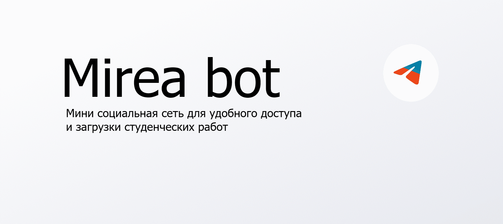

Это проект разработаный для учащихся вуза РТУ МИРЕА и КПК при МИРЕА.

#Основная цель проекта:
-Демнострация способностей меня как программиста
-Создание общей базы с готовыми работами и ответами на тесты среди учащихся

Бот написан на асинфронных aiogram и vkwave, имеет централизованную БД на sqlite.

#Основные достоинства:
-Скорость работы
-Доступность 

#Основные достижения:
-Работа на собственном сервере
-Пик популярности: 200 пользователей онлайн

#Ссылки на ботов для ознакомления:
[https://t.me/Cheatbase_bot](Телеграм бот)
[https://vk.com/mireabot](ВК бот)

